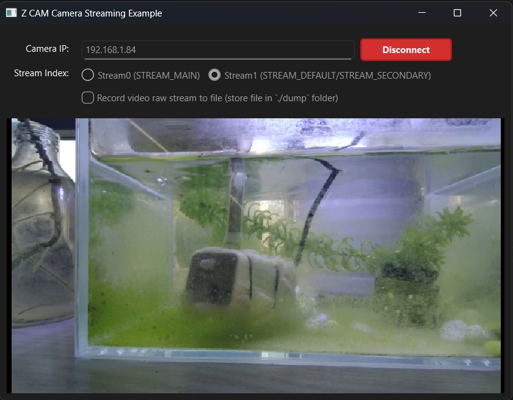

# Introduction
**Python wrapper for 'libssp' library which is a c++ library developed by Z CAM**

if you want to know more about '**libssp**', please visit [**C++ libssp**](https://github.com/imaginevision/libssp)

For now, 'pylibssp' is only tested on **Windows 11 64bit**, but all source code should be platform independent. 
I will try to support linux and mac in the future.

# project folder

'pylibssp' project folder structure is as follows:

```
pylibssp/
├── libssp/
│   ├── __init__.py
│   ├── _libssp.cpp             ← pybind11 c++ extension implementation
│   ├── sspclient.py            ← `SspClient` python wrapper
├── include/                    ← libssp c++ headers，used for compiling
├── lib/                        ← .lib/.a/.dll files，used for compiling
├── docs/ 
│   ├── api.md                  ← python sspclient class api document
├── example/
│   ├── dump_h26x.py            ← 'DumpH26x' class for dump video raw stream file
│   ├── README_dumph26x.md      ← `dump_h26x.py` read me document
│   ├── example.py              ← `SspClient` usage example 
│   ├── README_example.md       ← `example.py` read me document
├── tests/
│   ├── test_import.py          ← test script to check if `SspClient` can be imported
├── pyproject.toml              ← project configuration
├── setup.cfg                   ← setup configuration
├── setup.py                    ← setup script     
└── MANIFEST.in                 ← manifest file
└── README.md                   ← this file
```

# Build and test from source code

If you want to build python 'libssp' from source code, please make sure the build environment :

* **Windows 10(11) 64bit** (My current build environment)
  * Visual Studio 2017 (or later) with C++ build tools installed\
  * Python 3.11 (or later)

* **Linux** (*will be confirmed in future*)
  * gcc 11 (or later)\
  * python 3.11 (or later)

* **Mac** (*will be confirmed in future*)
  * Xcode 14 (or later)\
  * python 3.11 (or later)

then follow the steps below:

1. make a project folder in your computer and clone this repo
    ```shell
    mkdir pylibssp
    cd pylibssp
    git clone https://github.com/Jack-vexel-ws/pylibssp.git
    ```
2. install dependencies
    ```shell
    pip install -r requirements.txt
    ```
3. build and install libssp to current environment

    ```shell
    pip install . --no-build-isolation -v
    ```

If no any error occurs, you should be able to import 'libssp' in your python code now.

### Test

After building `libssp` successfully, you can test it by running the test code in 'pylibssp/tests' folder.

```shell
cd pylibssp/tests
python test_import.py
```

`test_import.py` try to import `libssp` and create a `libssp.SspClient` instance to start streaming. You will see the video and audio meta data and streaming data from the callback functions. `test_import.py` print these data to console.

>Please make sure your camera IP address and change it in `test_import.py`before running the test code.

### Rebuild or clean

```shell
# uninstall libssp
python -m pip uninstall libssp -y
python setup.py clean -all

# build and install again
pip install . --no-build-isolation -v
```

# Usage

If you did not want to build from source code, you can install `libssp` by pip directly.

Open a command prompt in windows and run
```shell
pip install libssp
```
In your python code, import `libssp` and create your `SspClient` instance.

`SspClient` Python API is similar to `libssp` c++ library, please refer to [SspClient API](./docs/api.md) documents in 'pylibssp/docs' folder for more details.

Here is a code example:

```python
import libssp

client = libssp.SspClient(camera_ip, 0x400000, 9999, libssp.STREAM_DEFAULT)

# Set callback functions
client.on_h264_data = on_h264_data
client.on_audio_data = on_audio_data
client.on_meta = on_meta
client.on_disconnected = on_disconnected
client.on_connected = on_connected
client.on_exception = on_exception
client.on_recv_buffer_full = on_recv_buffer_full

# Set HLG mode if needed
client.is_hlg = False

# Start client
client.start()

# ... do something

# Stop client
client.stop()
```
**NOTE**
> If you want to streaming zcam camera, you must set the stream index 0 or 1 and to be sure its streaming status is `idle`. In `example\example.py`, there are sample code to show how to set the stream index and how to sure the streaming status is 'Idle'.

[set the stream index (0 or 1) http command](https://github.com/imaginevision/Z-Camera-Doc/blob/master/E2/protocol/http/http.md#Network-streaming)
```
http://192.168.1.84/ctrl/set?send_stream=Stream0
or
http://192.168.1.84/ctrl/set?send_stream=Stream1
```
[query the streaming status http command](https://github.com/imaginevision/Z-Camera-Doc/blob/master/E2/protocol/http/http.md#Network-streaming)
```
http://192.168.1.84/ctrl/stream_setting?index=stream0&action=query
```
if you want to setting camera or its streaming parameters, please refer to the ZCAM offical [HTTP API Document](https://github.com/imaginevision/Z-Camera-Doc/blob/master/E2/protocol/http/http.md)

# Example
`example/example.py` is a full example code to show how to connect to zcam camera, start/stop streaming, record video raw stream data to file and real-time decodeing and real-time preview streaming video.



>Please refer to the `example.py` code and [README_example.md](./example/README_example.md) document to understand example more details.

## Example Dependencies
- `libssp`: Z CAM camera streaming python wrapper library
- `PySide6`: Qt GUI framework
- `av`: Video decoding (for preview)
- `numpy`: Array operations
- `requests`: HTTP API communication

Before running the example, please make sure you have installed all the dependencies. You can install them using pip:

```bash
pip install libssp PySide6 av numpy requests
```

**Run example**:

  ```bash
  cd example

  # run example with Qt gui (recommended)
  python example.py -gui

  #or

  # run example with cli (if you like command line)
  python example.py -cli
  ```

# License
MIT License