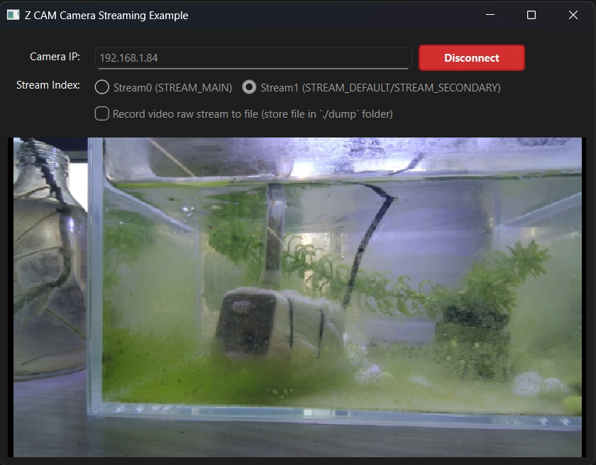

# Z CAM Camera Streaming Example

## Overview

This is a complete Z CAM camera streaming client example that demonstrates how to use the `pylibssp` library to connect to Z CAM cameras and receive real-time video and audio streams. The example provides both graphical interface and command-line interfaces, supporting real-time video preview, optional file recording, and other features.


You can download the example executable for Windows from the [releases page](https://github.com/Jack-vexel-ws/pylibssp/releases).


## Key Features

- **Dual Interface Support**: Qt GUI and command-line interfaces
- **Real-time Streaming**: Connect to Z CAM cameras and receive video and audio streams
- **Stream Selection**: Support for Stream0 (STREAM_MAIN) and Stream1 (STREAM_DEFAULT/STREAM_SECONDARY)
- **Real-time Preview**: H.264/H.265 video decoding and display using `PreviewH26xWnd`
- **Optional Recording**: Save H.264/H.265 raw stream data to files using `Dumph26x`
- **Thread Safety**: Multi-threaded design ensuring UI responsiveness and data processing efficiency

## System Requirements

- Python 3.7+
- Network connection to Z CAM camera
- Supported operating systems: Windows, Linux, macOS

## Installation

```bash
cd example
pip install -r requirements.txt
```

### Dependencies

- `libssp>=0.1.0`: Z CAM camera streaming library
- `PySide6>=6.0.0`: Qt GUI framework
- `av>=10.0.0`: Video decoding library
- `requests>=2.25.0`: HTTP API communication
- `numpy>=1.19.0`: Array operations
- `pyinstaller>=5.0.0`: Executable packaging tool (optional)

## Usage

### GUI Mode (Recommended)

1. **Start the program**:
   ```bash
   python example.py
   # or explicitly
   python example.py -gui
   ```

2. **GUI Interface**:
   - **Camera IP**: Enter your camera IP address (default: 192.168.1.84)
   - **Stream Selection**: Choose between Stream0 and Stream1 using radio buttons
   - **Recording**: Check "Record video raw stream to file" to enable recording
   - **Connect**: Click the green "Connect" button to start streaming
   - **Video Preview**: View real-time video in the preview area



### Command-line Mode

1. **Start CLI mode**:
   ```bash
   python example.py -cli
   ```

2. **Follow the prompts**:
   ```
   Please input z-cam camera IP (default: 192.168.1.84):
   
   Please select stream index:
   0. Stream0 (STREAM_MAIN)
   1. Stream1 (STREAM_DEFAULT)
   Enter your choice (1 or 0):
   
   Do you want to dump H.264/H.265 stream data to file? (y/n):
   ```

## Core Modules

### 1. Main Program Module (example.py)

**Main Functions**:
- Camera connection and streaming management
- Dual interface support (GUI/CLI)
- Callback function handling for video and audio data
- Thread management and resource cleanup

**Key Functions**:
- `query_stream_settings()`: Query camera stream settings
- `sent_stream_index()`: Send stream selection command
- `on_h264_data()`: Handle H.264 video data
- `on_audio_data()`: Handle audio data
- `on_meta()`: Handle stream metadata

**Configuration Parameters**:
- Default IP: 192.168.1.84
- Buffer size: 4MB (0x400000)
- Port: 9999
- Stream styles: Stream0 (STREAM_MAIN), Stream1 (STREAM_DEFAULT)

### 2. Video Recording Module (Dumph26x)

**Features**:
- Thread-safe file writing
- Queue-based frame data buffering
- Auto-cleanup and progress monitoring
- Support for H.264/H.265 formats

**Usage**:
```python
from dump_h26x import Dumph26x

# Create instance
dump = Dumph26x("output.h264")

# Start recording
dump.start()

# Write frame data
dump.write_frame(h264_frame_data)

# Stop recording
dump.stop()
```

**File Format**:
- Standard H.264/H.265 raw stream files
- Can be played directly with VLC
- Support conversion to MP4 format

### 3. Video Preview Module (PreviewH26xWnd)

**Features**:
- Hardware/software decoding support
- Thread-safe decoding and display
- Queue-based frame processing
- Native Qt widget integration

**Core Classes**:
- `DecodeH26x`: H.264/H.265 video decoder
- `PreviewH26xWnd`: Qt video display widget

**Usage**:
```python
from preview import PreviewH26xWnd

# Create preview widget
preview = PreviewH26xWnd()

# Start preview
preview.start()

# Send frame data
preview.push_frame(frame_type, frame_data)

# Stop preview
preview.stop()
```

## Threading Model

- **Main Thread**: Qt GUI event loop and user interaction
- **Client Thread**: Camera connection and SspClient lifecycle management
- **Decode Thread**: H.264/H.265 video decoding
- **Display Thread**: Video frame conversion and display
- **Recording Thread**: File writing operations (if recording is enabled)

## Output Files

### Recorded Stream Files

**Location**: `./dump/` directory (configurable)
**Naming**: `camera_{IP}_stream{INDEX}_{TIMESTAMP}.{CODEC}`
**Supported Formats**: H.264, H.265

**Example Filenames**:
```
camera_192.168.1.84_stream1_20231201_143022.h264
camera_192.168.1.84_stream0_20231201_143022.h265
```

### Convert to MP4

Use ffmpeg to convert raw stream files to MP4:

```bash
ffmpeg -i -r 30000/1001 source_file.h264 -c copy dest_file.mp4
```

> **Note**: `-r 30000/1001` is the frame rate (29.97 fps). Adjust according to your stream's frame rate. This is critical for proper playback.

## Packaging Guide

### Requirements

- Python 3.7+
- PyInstaller
- Required dependencies (see requirements.txt)

### Packaging Steps

1. **Prepare Environment**:
   ```bash
   cd example
   pip install -r requirements.txt
   ```

2. **Configure Redirect**:
   - Open `example.py`
   - Set `ENABLE_PRINT_REDIRECT = True` (production version)
   - Set `ENABLE_PRINT_REDIRECT = False` (development/debug version)

3. **Package**:
   ```bash
   pyinstaller example.spec
   ```
   or
   ```bash
   python buid_example_exe.py
   ```

4. **Run**:
   - **Development Environment**: Run `example.py` directly
   - **Packaged Environment**: Run the generated `.exe` file

## Logging

### Log Files

The program automatically creates a `logs` directory to store log files:
- **Development Environment**: `logs` directory is under the `example.py` file directory
- **Packaged Environment**: `logs` directory is under the exe file directory

Log file naming: `print_output_YYYYMMDD_HHMMSS.log`

## Common Issues

### 1. Camera Connection Issues

**Problem**: Camera not found
**Solution**:
- Check network connectivity and IP address
- Ensure camera is on the same local network as your computer

### 2. Stream Not Available

**Problem**: Stream not available
**Solution**:
- Verify selected stream (0 or 1) status is `idle`
- If stream is in use, streaming will fail

### 3. Video Preview Issues

**Problem**: Video preview not working
**Solution**:
- Ensure `av` package is installed: `pip install av`
- Check if H.264/H.265 decoder is supported on your system

### 4. Recording Failures

**Problem**: Recording fails
**Solution**:
- Check disk space and write permissions
- Ensure `./dump/` directory exists or can be created

### 5. Stream Settings

**Configuration Method**:
- Use Z CAM official [HTTP API commands](https://github.com/imaginevision/Z-Camera-Doc/blob/master/E2/protocol/http/http.md) to configure stream settings
- Stream0 basic settings match camera shooting format, you can adjust Stream0 bitrates with zcam official http command
- Stream1 can be configured independently, but resolution is limited to camera shoot resolution


## License

MIT License 