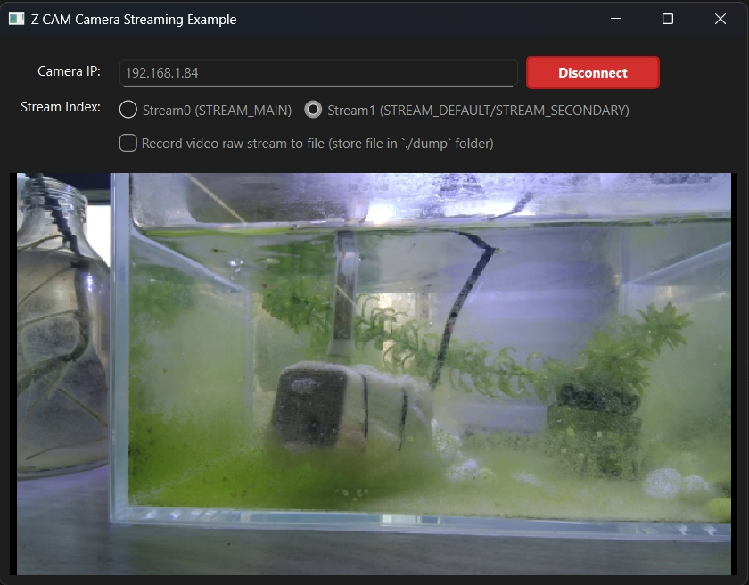

# Example.py - Z CAM Camera Streaming Client

## Overview

`example.py` demonstrates how to use the `pylibssp` library to connect to a Z CAM camera and receive real-time video and audio streams. It provides both GUI and command-line interfaces for streaming connection, data handling, optional file recording, and real-time video preview.

## Features

- **Dual Interface**: GUI (Qt) and Command-line interfaces
- **Camera Connection**: Connect to Z CAM cameras via network
- **Stream Selection**: Choose between Stream0 (STREAM_MAIN) and Stream1 (STREAM_DEFAULT/STREAM_SECONDARY)
- **Real-time Streaming**: Receive live video and audio data
- **Video Preview**: Real-time H.264/H.265 video decoding and display using `PreviewH26xWnd`
- **Optional Recording**: Save H.264/H.265 raw stream data to file using `Dumph26x`

## Usage

### GUI Mode (Default)

1. **Run the script**:
   ```bash
   python example.py
   # or explicitly
   python example.py -gui
   ```

2. **GUI Interface**:
   - **Camera IP**: Enter your camera IP address (default: 192.168.1.84)
   - **Stream Selection**: Choose between Stream0 and Stream1 using radio buttons
   - **Recording**: Check "Record video raw stream to file" to enable recording
   - **Connect**: Click the green "Connect" button to start streaming
   - **Video Preview**: Real-time video display in the preview area

   

   
### Command-line Mode

1. **Run in CLI mode**:
   ```bash
   python example.py -cli
   ```

2. **Enter camera IP address**:
   ```
   Please input z-cam camera IP (default: 192.168.1.84):
   ```

3. **Select stream index**:
   ```
   Please select stream index:
   0. Stream0 (STREAM_MAIN)
   1. Stream1 (STREAM_DEFAULT)
   Enter your choice (1 or 0):
   ```

4. **Choose recording option**:
   ```
   Do you want to dump H.264/H.265 stream data to file? (y/n):
   ```

## Key Functions

### Stream Settings
- `query_stream_settings(ip, stream_index)`: Query camera stream settings
- `sent_stream_index(ip, stream_index)`: Send stream selection command to camera

### Callback Functions
- `on_h264_data(data)`: Handle H.264 video data and send to preview
- `on_audio_data(data)`: Handle audio data
- `on_meta(video_meta, audio_meta, meta)`: Handle stream metadata
- `on_connected()`: Connection established
- `on_disconnected()`: Connection lost

### Classes
- `MainWindow`: Main Qt window with control panel and video preview
- `PreviewH26xWnd`: Video preview widget with real-time decoding
- `DecodeH26x`: H.264/H.265 decoder using av package

## Configuration

### Camera Settings
- **Default IP**: 192.168.1.84 (configurable in GUI)
- **Buffer Size**: 4MB (0x400000)
- **Port**: 9999
- **Stream Styles**: 
  - Stream0: STREAM_MAIN
  - Stream1: STREAM_DEFAULT/STREAM_SECONDARY

### Recording Options
When recording is enabled:
- **Directory**: `./dump/` folder (configurable via `DUMP_FOLDER_NAME`)
- **Filename**: `camera_{IP}_stream{INDEX}_{TIMESTAMP}.{CODEC}`
- **Supported**: H.264, H.265
- **Automatic**: Directory creation and file management

## Threading Model

- **Main Thread**: Qt GUI event loop and user interaction
- **Client Thread**: Camera connection and `SspClient` lifecycle
- **Decode Thread**: H.264/H.265 video decoding (`PreviewH26xWnd`)
- **Display Thread**: Video frame conversion and display
- **`Dumph26x` Thread**: File writing operations (if recording)

## Dependencies

### Required Packages
- `libssp`: Z CAM camera streaming python wrapper library
- `PySide6`: Qt GUI framework
- `av`: Video decoding (for preview)
- `numpy`: Array operations
- `requests`: HTTP API communication

### Optional Packages
- `ffmpeg`: For converting recorded files to MP4

## Output Files

### Recorded Streams
- **Class**: [`Dumph26x`](./dump_h26x.py) for recording H.264/H.265 streams
- **Documentation**: See [README_dumph26x](./README_dumph26x.md) for details
- **Location**: `./dump/` directory (configurable)
- **Format**: Raw H.264/H.265 video stream
- **Playback**: VLC can play raw video stream files directly

### Example filenames
```
camera_192.168.1.84_stream1_20231201_143022.h264
camera_192.168.1.84_stream0_20231201_143022.h265
```

### Convert to MP4
To convert raw H.264/H.265 files to MP4 format:

```bash
ffmpeg -i -r 30000/1001 source_file.h264 -c copy dest_file.mp4
```

> **NOTE**: `-r 30000/1001` is the frame rate (29.97 fps). Adjust according to your stream's frame rate. **This is critical for proper playback**.

## Integration

### Using SspClient in Your Own Code

```python
import libssp

# Create client
client = libssp.SspClient(camera_ip, buffer_size, port, stream_style)

# Set callbacks
client.on_h264_data = your_h264_handler
client.on_audio_data = your_audio_handler
client.on_meta = your_meta_handler

# Start streaming
client.start()

# ...

# Stop streaming
client.stop()
```

### Using PreviewH26xWnd and DecodeH26x
For video preview functionality, please refer to [README_preview.md](./README_preview.md) for detailed usage examples of `PreviewH26xWnd` and `DecodeH26x` classes.

## Common Issues

1. **Camera not found**: 
   - Check network connectivity and IP address
   - Ensure camera is on the same local network as your computer

2. **Stream not available**: 
   - Verify selected stream (0 or 1) is **`idle`**
   - If stream is in use, streaming will fail

3. **Video preview not working**:
   - Ensure `av` package is installed: `pip install av`
   - Check if **H.264/H.265** decoder is supported on your system

4. **Recording fails**:
   - Check disk space and write permissions
   - Ensure `./dump/` directory exists or can be created

5. **Stream Settings**: 
   - Use Z CAM official [HTTP API commands](https://github.com/imaginevision/Z-Camera-Doc/blob/master/E2/protocol/http/http.md) to configure stream settings
   - Stream0 basic settings match camera shooting format, you could adjust stream0 bitrates with zcam offical http command
   - Stream1 can be configured independently, but resolution is limited to camera shoot resolution